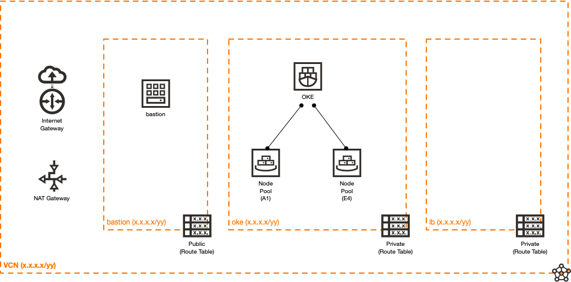

# Sample Oracle Cloud Infrastructure Container Engine for Kubernetes Environment

## Introduction
This is a basic sample of an Oracle Cloud Infrastructure (OCI) Container Engine for Kubernetes  environment that is deployed using Crossplane and the OCI Crossplane provider. This is not meant for production use; it is only for demonstration purposes.

### Topology



All resources are deployed into an existing compartment (or at the root compartment level), for which an Oracle Cloud Identifier (OCID) is provided in the claim.

Three subnets, shown in the following table, are created with the CIDR for each being specified by the user in the claim.

| Name | Type | Description |
|------|------|-------------|
| `oke` | Private | The Container Engine cluster and node pools are placed in this subnet. |
| `lb` | Private | The Load Balancers (LBs) are placed in this subnet. |
| `bastion` | Public | A "jump box" (bastion) instance is placed in this subnet. |

### Security Policies
An empty security list is used with the different subnets (lb, oke, and bastion).  Network security groups (NSGs) are created, permitting different traffic flows within the environment.

Look at the `composition-okenetwork.yml` file to see the different security rules. The following table displays a summary of the security rules.

| Source NSG | Destination | Direction | Protocol | Description |
|---------|-----|-----------|----------|-------------|
| `oke` | `oke` NSG | Egress | all | Permit intra-subnet traffic (outbound) |
| `oke` | `oke` NSG | Ingress | all | Permit intra-subnet traffic (inbound) |
| `oke` | `bastion` NSG | Ingress | all | Permit traffic from the bastion to Container Engine compute instances |
| `oke` | `lb` NSG | Ingress | TCP | Permit all TCP traffic from the Load Balancers |
| `oke` | `0.0.0.0/0` | Egress | TCP/443 | Permit outbound HTTPS traffic from the Container Engine compute instances |
| `bastion` | `oke` NSG | Egress | all | Permit all traffic to the Container Engine compute instances from the bastion |
| `bastion` | `0.0.0.0/0` | Egress | TCP | Permit all outbound TCP traffic from the bastion |
| `bastion` | `lb` NSG | Egress | TCP | Permit all TCP traffic to the Load Balancers |
| `bastion` | `permittedAccessCidr` value | Ingress | TCP/22 | Permit SSH traffic from a user-provided CIDR |
| `lb` | `bastion` NSG | Ingress | TCP | Permit inbound TCP traffic from the bastion |
| `lb` | `oke` NSG | Egress | TCP | Permit all outbound TCP traffic to the Container Engine compute instances |

### Routing Policies
There are two route tables, `public` and `private`.  As the names imply, one is used for subnets that permit public IP addresses, the other for those using only private IP addresses.  An internet gateway is used for the `public` route table and a NAT gateway is used for the `private` route table.

## Getting Started
These instructions assume that you're using Rancher Desktop, Docker Desktop, or some other locally running Kubernetes implementation.
1. Install Crossplane.
    ```
    helm install crossplane --namespace crossplane-system crossplane-stable/crossplane
    ```
1. Clone the Crossplane repository.
    ```
    git clone git@github.com:crossplane/crossplane.git
    ```
1. Install the different custom resource definitions (CRDs) used by Crossplane.
    ```
    kubectl apply -f crossplane/cluster/crds
    ```
1. Install role binding for the locally running Kubernetes `crossplane-system` account.
    ```
    kubectl apply -f crossplane-cluster-role-binding.yml
    ```
   **Note:** This step is used for locally running Kubernetes instances, such as in this demo and will install role binding and maps for the Kubernetes dashboard user.
1. Copy `examples/providerconfig/secret.yaml.tmpl` to `secret.yaml` and modify its contents for your environment.
1. Install the OCI Crossplane provider.
    ```
    kubectl apply -f examples/providerconfig/crossplane-namespace.yaml
    kubectl apply -f examples/providerconfig/secret.yaml
    kubectl apply -f package/crds
    kubectl apply -f examples/providerconfig/providerconfig.yaml
    ```
1. Apply the Composite Resource Definition (XRD) and Composition for the oke network.
    ```
    kubectl apply -f xrd-okenetwork.yml
    kubectl apply -f composition-okenetwork.yml
    ```
1. Copy `claim-okenetwork.yml` to `claim.yml` and enter the correct values for your environment, then apply it.
    ```
    kubectl apply -f claim.yml
    ```
1. Start the local OCI Crossplane provider.
    ```
    make run
    ```

### Interacting with the New Environment
Run `kubectl describe okenetwork oketest`.

This will show several useful bits of information in the status, including the bastion public IP address and the Container Engine cluster OCID (along with other potentially needed OCIDs).

This topology is designed to tunnel (port forward) traffic via the bastion to and from the Container Engine cluster (which only has a private IP address), as well as the Load Balancer (as services are deployed).

Here is an example of how to set up an SSH port forwarding session for accessing the Container Engine for Kubernetes API:
```
ssh -L 6443:<OKE_cluster_private_IP>:6443 opc@<bastion_pub_ip>
```

Here's an example of getting to a load balancer-based app (service):
```
ssh -L 8081:<LB_private_IP>:8081 opc@<bastion_public_ip>
```

To access the Container Engine cluster, you need to follow the directions (run an OCI CLI command) given in the Container Engine cluster's Quick Start screen.  This will set up a new config context in `~/.kube/config` that you can switch between.  Use `oci ce cluster create-kubeconfig --cluster-id <oke_cluster_ocid> --file $HOME/.kube/config --region <region> --token-version 2.0.0  --kube-endpoint PRIVATE_ENDPOINT`

When interacting with the local Kubernetes, use `kubectl config use-context rancher-desktop` (or whatever is the proper context name for your environment). Then to interact with the Container Engine cluster, change to its context.

## Contributing
This project is open source.  Please submit your contributions by forking this repository and submitting a pull request.  Oracle appreciates any contributions that are made by the open source community.

## License
Copyright (c) 2022 Oracle and its affiliates.

Licensed under the Universal Permissive License (UPL), Version 1.0.

See [LICENSE](../../LICENSE) for more details.

ORACLE AND ITS AFFILIATES DO NOT PROVIDE ANY WARRANTY WHATSOEVER, EXPRESS OR IMPLIED, FOR ANY SOFTWARE, MATERIAL OR CONTENT OF ANY KIND CONTAINED OR PRODUCED WITHIN THIS REPOSITORY, AND IN PARTICULAR SPECIFICALLY DISCLAIM ANY AND ALL IMPLIED WARRANTIES OF TITLE, NON-INFRINGEMENT, MERCHANTABILITY, AND FITNESS FOR A PARTICULAR PURPOSE.  FURTHERMORE, ORACLE AND ITS AFFILIATES DO NOT REPRESENT THAT ANY CUSTOMARY SECURITY REVIEW HAS BEEN PERFORMED WITH RESPECT TO ANY SOFTWARE, MATERIAL OR CONTENT CONTAINED OR PRODUCED WITHIN THIS REPOSITORY. IN ADDITION, AND WITHOUT LIMITING THE FOREGOING, THIRD PARTIES MAY HAVE POSTED SOFTWARE, MATERIAL OR CONTENT TO THIS REPOSITORY WITHOUT ANY REVIEW. USE AT YOUR OWN RISK. 

